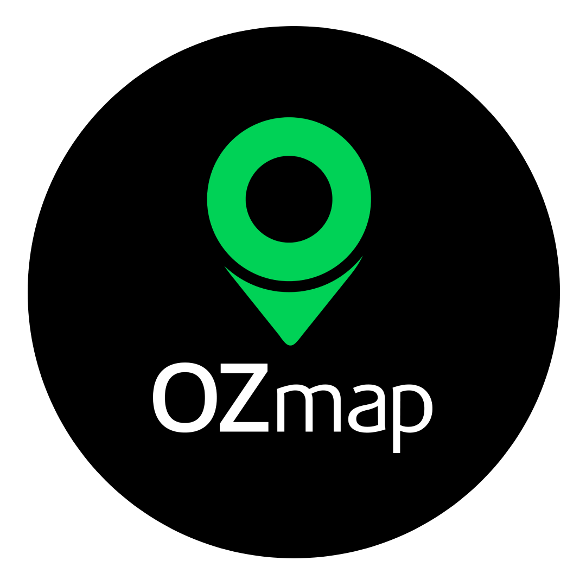

## Desafio Backend Node OZmap

    

### 💻 Project Description

- This project is an API that simulates data manipulation, through lib `OZmap SDK`, it must be possible to make a searching on a specific collection data through `id` and `target`.

- Get Automaticaly data from a `json-server` database, it's possible to `schedule` a `timer` or `date` to set the frequency of it.

- Transfor the data at the previous step, to a valid `OZmap SDK` standard.

- Send the data at previous step to `OZmap SDK`, using the lib and simulating the real usage.

- Save all the synchronized data at the previous step in a `MONGODB` trougth `Prisma` and `Docker`.

- It's possible to save all the logs of successful and fail operations in a `file` through lib `winston`.

### 🚀 Technologies

- Typescript
- Nodejs in version v20.18.0 (LTS)
- Express
- OZmap SDK 
- Docker
- MongoDb
- Prisma
- Json-server
- Node-schedule
- Tsyringe
- Winston-logger

### 🚀 End-Points

- Use an http request provider such as `Insomnia` or `Postman` and even the `ThunderClient` extention on vscode IDE to create all the follow endpoints, to be able to test the app.

###### GET: `getData\:id`
###### POST: `getAutoData`
###### POST: `tranformData`
###### POST: `sendDataToOZmap`
###### POST: `saveDataAtDB`

### 🛠️ About .env.example file

- Make sure that all the enviroment variables is filled with the rigth configurations, you can rename this file after do it from `.env.example` to `.env`, or create a new one ........... it is very `IMPORTANT` to the all the stuffs working well.

- `IMPORTANT` .... Please before runnnig and testing all the endpoints of the app, `DELETE` these 2 files `base_data.json` and `ozmap_output.json`, from `src/utils/copy-mock-database`, they will be created again when you start to running the endpoints ... I justed put them away for example of the work done.

### 🛠️🚀 How to running this application

- For running the application at the following endpoints `getData\:id` and`getAutoData`, you don't need to run the `docker` container, just split your terminal windown and run `yarn dev` to start the app, and the original database of the challenge with the follow command `yarn json:server:origindb`.

- For running the application at the following endpoints `tranformData` and `sendDataToOZmap` you don't need to run the `docker` container, just split your terminal windown and run `yarn dev` to start the app, and the processed database data `yarn json:server:ozmap_output`.

- For the last endpoint `saveDataAtDB`, you need to run `yarn dc:up` to run the docker ... wait until finish, then in another terminal windown run `yarn setup:prisma`, for prepere prisma to app .... wait until finish, then run `yarn dev` to start the app ... finally in other terminal windown run `json:server:ozmap_output`.

- For check the datas saved at `mongodb` with all the previous steps running, .... then run `npx prisma studio`, this is going to open a brownser windonw with the interface tool of `prisma studio`, that's able to manipulate the datas through the database.

### 📚 About the architecture of the application.

- This app was created as the same as `MVC` architecture, trying to keep the good organization and responsability of the layers, to make easy to give maintenance and to be able to implement new stuffs as well.

